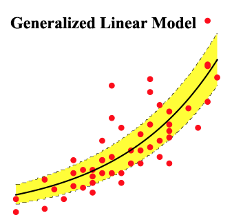

# java-libsvm
Package provides the direct java conversion of the origin libsvm

[](https://travis-ci.org/chen0040/java-libsvm) [](https://coveralls.io/github/chen0040/java-libsvm?branch=master)

# Usage

# One-class SVM 

Below is the code to create and train a one-class SVM:

```java
OneClassSVM algorithm = new OneClassSVM();
algorithm.fit(training_data)
```

Below is the code to predict if data point is an outlier:

```java
algorithm.isAnomaly(data_point)
```

# SVR

Below is the code to create and train a SVR for regression modelling:

```java
SVR algorithm = new SVR();
algorithm.fit(training_data)
```

Below is the code to perform data regression prediction:

```java
algorithm.isAnomaly(data_point)
```

# Data Format

The data format default is the DataFrame class, which can be used to load csv and libsvm format text file. Please refers to the unit test cases on how they can be used.

# Sample codes

Below is a sample code example of the one-class SVM for the example below here:


```java
import com.github.chen0040.svmext.data.DataFrame;
import com.github.chen0040.svmext.data.DataQuery;
import com.github.chen0040.svmext.data.Sampler;
import com.github.chen0040.svmext.oneclass.OneClassSVM;

DataQuery.DataFrameQueryBuilder schema = DataQuery.blank()
      .newInput("c1")
      .newInput("c2")
      .newOutput("anomaly")
      .end();

Sampler.DataSampleBuilder negativeSampler = new Sampler()
      .forColumn("c1").generate((name, index) -> randn() * 0.3 + (index % 2 == 0 ? -2 : 2))
      .forColumn("c2").generate((name, index) -> randn() * 0.3 + (index % 2 == 0 ? -2 : 2))
      .forColumn("anomaly").generate((name, index) -> 0.0)
      .end();

Sampler.DataSampleBuilder positiveSampler = new Sampler()
      .forColumn("c1").generate((name, index) -> rand(-4, 4))
      .forColumn("c2").generate((name, index) -> rand(-4, 4))
      .forColumn("anomaly").generate((name, index) -> 1.0)
      .end();

DataFrame trainingData = schema.build();

trainingData = negativeSampler.sample(trainingData, 200);

System.out.println(trainingData.head(10));

DataFrame crossValidationData = schema.build();

crossValidationData = negativeSampler.sample(crossValidationData, 40);

DataFrame outliers = schema.build();

outliers = positiveSampler.sample(outliers, 40);

final double threshold = 0.5;
OneClassSVM algorithm = new OneClassSVM();
algorithm.set_gamma(0.1);
algorithm.set_nu(0.1);
algorithm.thresholdSupplier = () -> 0.0;

algorithm.fit(trainingData);

for(int i = 0; i < crossValidationData.rowCount(); ++i){
 boolean predicted = algorithm.isAnomaly(crossValidationData.row(i));
 logger.info("predicted: {}\texpected: {}", predicted, crossValidationData.row(i).target() > threshold);
}

for(int i = 0; i < outliers.rowCount(); ++i){
 boolean predicted = algorithm.isAnomaly(outliers.row(i));
 logger.info("outlier predicted: {}\texpected: {}", predicted, outliers.row(i).target() > threshold);
}
```


Below is another complete sample code of the SVR to predict y = 4 + 0.5 * x1 + 0.2 * x2:



```java
import com.github.chen0040.svmext.data.DataFrame;
import com.github.chen0040.svmext.data.DataQuery;
import com.github.chen0040.svmext.data.Sampler;
import com.github.chen0040.svmext.oneclass.SVR;

DataQuery.DataFrameQueryBuilder schema = DataQuery.blank()
      .newInput("x1")
      .newInput("x2")
      .newOutput("y")
      .end();

// y = 4 + 0.5 * x1 + 0.2 * x2
Sampler.DataSampleBuilder sampler = new Sampler()
      .forColumn("x1").generate((name, index) -> randn() * 0.3 + index)
      .forColumn("x2").generate((name, index) -> randn() * 0.3 + index * index)
      .forColumn("y").generate((name, index) -> 4 + 0.5 * index + 0.2 * index * index + randn() * 0.3)
      .end();

DataFrame trainingData = schema.build();

trainingData = sampler.sample(trainingData, 200);

System.out.println(trainingData.head(10));

DataFrame crossValidationData = schema.build();

crossValidationData = sampler.sample(crossValidationData, 40);

SVR svr = new SVR();
svr.fit(trainingData);

for(int i = 0; i < crossValidationData.rowCount(); ++i){
 double predicted = svr.transform(crossValidationData.row(i));
 double actual = crossValidationData.row(i).target();
 System.out.println("predicted: " + predicted + "\texpected: " + actual);
}
```
